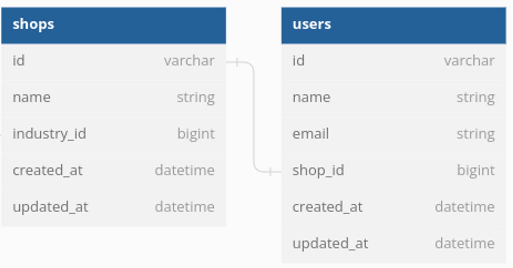

## Description

## Description

Implementing service objects and handling errors in many ways:
Example:

1. Writing service objects using dry-monads with do notation
2. using dry-monads without do notation
3. …(your implementation)

## Domain-specific problem

Implement user registration for a Shopify-like application.

## Task details:

As a user of our Shopify-like application, I should be able to create an account by providing my name, email, shop name, and industry ID.

During the registration process, two objects should be created in the database: a User object and a Shop object. The User object should include the name and email provided by the user, and the Shop object should include the shop name and industry ID provided by the user.

I should get mail about newly created account.

## Input data

```ruby
params = {users[:name, :email], shops[:name, :industry_id] }
```

## Output

You can pick one of the following:

1. Service object returns string message(success message or failure_message).
2. Service object returns string message(success message or failure_message) and newly created objects.
3. You can make up what it should return

## Database architecture



## Deliverables

1. Service object code
2. Controller action/method(how to call this service and how to return errors or success messages to user)
    - The controller will redirect to dashboard_page with success message
    - Or will render views registrations/new with failure message.
3. Tests for the service objects

   You can choose how many use cases you will cover.


---

**Have Fun** 🙂

Deadline: 10.01.2023 (second Tuesday of the month)
You can share your SO implementation on January BRUG.
We will have 10 mins to show people our implementation.

At the end of meetup people can pick the best service object implementation in the survey.
